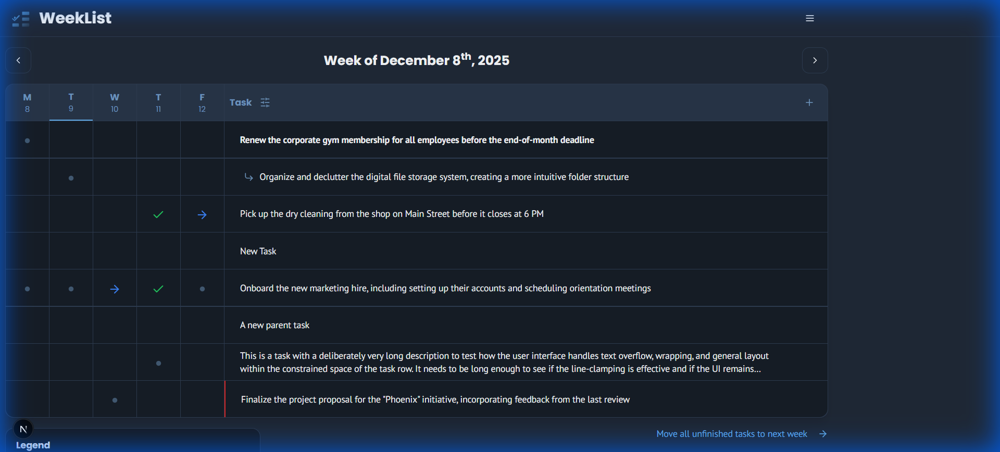

# WeekList

**Your Weekly Task Manager for Deep Focus.**



WeekList transforms the traditional "Running To-do List" into a powerful digital experience. Designed for clarity, it gives you a high-level view of your entire week, helping you manage priorities, track progress, and stay focused on what matters.

## ✨ Key Features

*   **📅 Weekly Grid View**: Visualize your workload. See your week at a glance and move tasks across days effortlessly.
*   **🤖 AI Task Breakdown** *(New)*: Overwhelmed by a big task? Let our AI break it down into manageable sub-tasks for you. *(Requires API Key)*.
*   **👁️ Focus Mode** *(New)*: Toggle "Hide Completed" to clear the clutter and focus only on what's left to do.
*   **✅ Rich Statuses**: Go beyond "done". Track tasks as Planned, Completed, Rescheduled, or Cancelled.
*   **🪜 Sub-tasks**: Organize complex projects with nested steps.
*   **🖱️ Drag & Drop**: Intuitive reordering and rescheduling.

## 🚀 Getting Started

WeekList is built with **Next.js** and designed to be easy to set up.

### Prerequisites

-   Node.js 18+
-   Google AI API Key (optional, for AI features) - [Get one here](https://aistudio.google.com/)

### Installation

1.  **Clone the repository** and install dependencies:
    ```bash
    npm install
    ```

2.  **Configure Environment**:
    Create a `.env` file in the root directory:
    ```env
    GOOGLE_GENAI_API_KEY=your_api_key_here
    ```

3.  **Run Locally**:
    ```bash
    npm run dev
    ```

4.  Open [http://localhost:9002](http://localhost:9002) to start organizing your week!

## 🔮 Roadmap

-   [ ] User Authentication & Cloud Sync
-   [ ] Database Support (PostgreSQL/Supabase)
-   [ ] Mobile App (React Native)

## 📄 License

This project is licensed under the built-in [GPLv3 License](LICENSE).

---

*Built with ❤️ using Next.js, Tailwind CSS, and Shadcn UI.*
